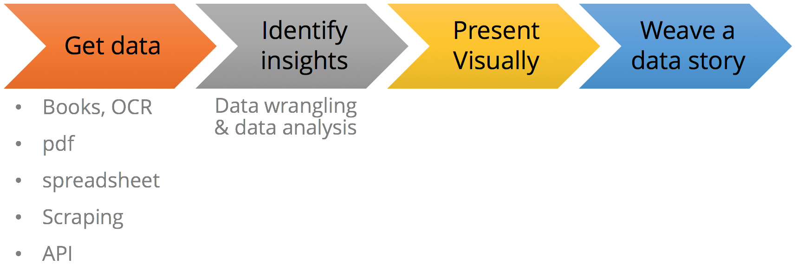
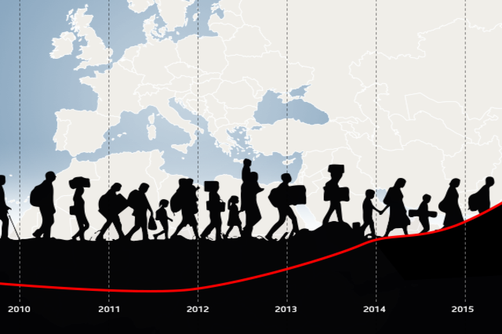
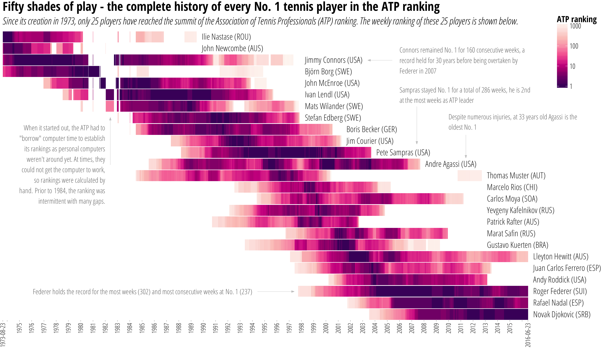

```{r setup, include=FALSE}
knitr::opts_chunk$set(echo = FALSE)
```

## Outline

* SWI & data-driven journalism (ddj)
* Why R?
* Typical ddj workflow
* DDJ examples from SWI with R


## WTF is swissinfo.ch?

* International service from the SRG-SSR
* Previously, Swiss Radio International
* Web-only, 10 languages, ~800K UCs / month
* Editorially: Explainer / background stories with a Swiss aspect. Not focus on news, magazine.
<br>
<hr>
DDJ mainly for explanatory journalism and data visualisations

<blockquote><small>
“Data journalism increasingly relies on bespoke or technically complex datasets whose creation, curation or comprehension requires specialist data gathering skills and/or specialist data analysis skills and/or specialist data visualisation skills.”</blockquote>[John Murdoch, FT Data](http://johnburnmurdoch.github.io/slides/data-journalism-manifesto)</small>

## Why R?


> - Free & open source
> - Supports transparent and reproducible workflow (like with Jupyter Notebook)
> - Large package ecosystem + integration with other tools/frameworks (github, javascript, ...)
> - Awesome at data wrangling + static graphics (tidyverse)

# Interactive graphics from R

## Leaflet.js {data-background-iframe="https://interactive.swissinfo.ch/2017_02_21_weaponExportCH_2016/weaponExportCH_2016_EN.html" .bindings}

## Highcharts {data-background-iframe="https://interactive.swissinfo.ch/2017_03_02_swissWatch_TPT/Swiss_watch_export_stackedArea_EN.html" .bindings}

## Fancy d3.js viz {data-background-iframe="https://interactive.swissinfo.ch/2017_03_27_asylumEU/asylumEurope_flows_2016_EN.html" .bindings}

## Fluid layout: bootstrap + Highcharts {data-background-iframe="https://interactive.swissinfo.ch/2017_06_08_DDballo_themes/chVotes_byKeyword_prod_EN.html" .bindings}


## Typical DDJ workflow 



**One framework, R, to rule them all**

> - Transparency & reproducibility

# DDJ examples with R 

```{r cleanup example folder, echo = T}
library(magrittr)
dir("./2016_10_26_DublinMess/data", all.files = T, recursive = T, full.names = T) %>% file.remove()
dir("./2016_10_26_DublinMess/output", all.files = T, recursive = T, full.names = T) %>% file.remove()

dir("./2016_06_14_tennisATP/data", all.files = T, recursive = T, full.names = T) %>% file.remove()
dir("./2016_06_14_tennisATP/output", all.files = T, recursive = T, full.names = T) %>% file.remove()
dir("./2016_06_14_tennisATP/input", pattern = "alln1", all.files = T, recursive = T, full.names = T) %>% file.remove()
```


## Are the Swiss too strict about the Dublin accords?

[](https://www.swissinfo.ch/eng/politics/migration-policy_are-the-swiss-too-strict-about-the-dublin-accords-/42973448)

## The complete history of every No. 1 male tennis player

[](https://www.swissinfo.ch/eng/who-is-the-best-_the-complete-history-of-every-no--1-tennis-player/42274984)

# Code
